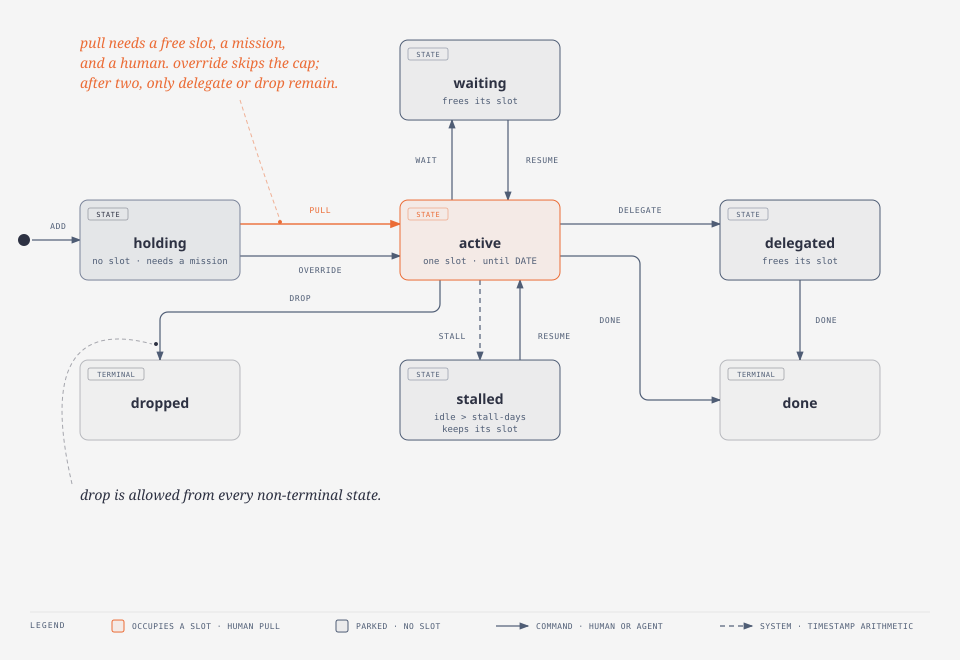

# attention-firewall

`attention-firewall` (CLI: `fw`) is an open-source, local-first tool that helps
one knowledge worker measure and protect their bandwidth. It is inspired by
Cal Newport's *Slow Productivity* and implements his pull-based, two-column
project management style: a hard-capped **Active** column of slots for the
things you are actually working on, and a **Holding** column for everything
else that has been asked of you. Work is pulled into an active slot when one
opens. It is never pushed in by whoever asked loudest. The tool exists for the
people who get invited onto every project and need an honest number to answer
"when can you take this?" with a date instead of a yes.

## Install

```sh
uv tool install attention-firewall
fw --version
```

## Quick start

`fw` keeps everything in one local directory (the context). Nothing leaves your
machine.

```sh
fw init                                   # creates $XDG_DATA_HOME/fw with a 3-slot cap
fw mission add ship-fw --title "Ship attention-firewall 1.0"
fw add "Review the Q4 deck" --mission ship-fw
fw add "Write the intake spec"            # holding, no mission yet
fw map 2 ship-fw
fw pull 1 --until 2026-10-01              # into an active slot, with a projected end date
fw status
```

`fw status` prints both columns, slots used and free, and `next_open`: today if
a slot is free, otherwise the earliest `--until` date among active items. That
date is the honest answer to "when can you take this?".

Items move along fixed edges: `pull` and `override` (holding to active), `wait`
and `resume`, `delegate`, `done`, `drop`. An active item nobody has touched for
seven days is marked `stalled` by timestamp arithmetic the next time any command
runs. `fw config set slot-cap N` and `fw config set stall-days N` change the
defaults. `fw log` shows every event and `fw export --format jsonl|csv --out
PATH` writes a plain file you can read without `fw`.

Use `--context PATH` or `FW_CONTEXT` to keep separate contexts (work, personal).
They never sync.

### How items move

Every item is in exactly one state. Every command is an edge in this graph and
is written to the log. Nothing enters the Active column except through `pull`
or `override`, and only a human runs those.



The source is `diagrams/item-graph.html`, built with the diagram-design plugin.

## Calling fw from an agent

`fw` never prompts and never needs a TTY, so a coding agent can drive it.

- Pass `--json` to get exactly one JSON object on stdout with `ok: true`. On
  failure stdout is empty and stderr holds `{"ok": false, "code": N, "message": "..."}`.
- Pass `--actor agent:<name>` (or set `FW_ACTOR`) so every event records who
  acted. The default is `human`.
- `pull`, `override`, and `resume` commit the human's time. An agent must add
  `--human-allowed` to run them, and the event records `human_allowed: true`.
  This is an honesty record in the log, not a security boundary.
- Pass `--now TIMESTAMP` to make time an explicit input, for example in tests.

### Install the skill

`fw` ships a skill file in the Agent Skills format that tells an agent what
`fw` is and the rules for calling it. `fw skill install` writes it to the
user-level skill directory of every agent it finds on the machine (Claude Code,
pi, opencode, Codex). Add `--project` to write to each agent's project-level
directory under the current folder instead, `--agent NAME` to pick specific
agents, or `--dir PATH` to write to `PATH/fw/SKILL.md` and nowhere else.
Re-run it after upgrading `fw` to refresh the skill. `fw skill show` prints the
skill so you can pipe it anywhere. Neither command needs an initialized context.

```sh
fw skill install                          # every detected agent, user level
fw skill install --agent pi --project     # one agent, this project only
fw skill install --dir ~/my-skills        # writes ~/my-skills/fw/SKILL.md
```

The same file lives at `skills/fw/SKILL.md` in the repository, so
`npx skills add jlargs64/attention-firewall` works too.

Exit codes:

| Code | Meaning |
|---|---|
| 0 | Success |
| 1 | Unexpected internal error |
| 2 | Usage error: bad option, argument, actor, or timestamp |
| 3 | Refused by a rule: invalid edge, column full, unmapped item, override lock, human-only edge, duplicate mission, already initialized |
| 4 | Not found: context not initialized, unknown item or mission |
| 5 | Malformed ledger line (the message names the line) |

## Contributing

The project uses [uv](https://docs.astral.sh/uv/) for everything. 

```sh
uv sync --locked
uv run pre-commit install
```

Every commit runs ruff, pytest (with a 70% coverage floor), and detect-secrets
through pre-commit. CI runs the same hooks. See `AGENTS.md` for the full rules
of engagement.
